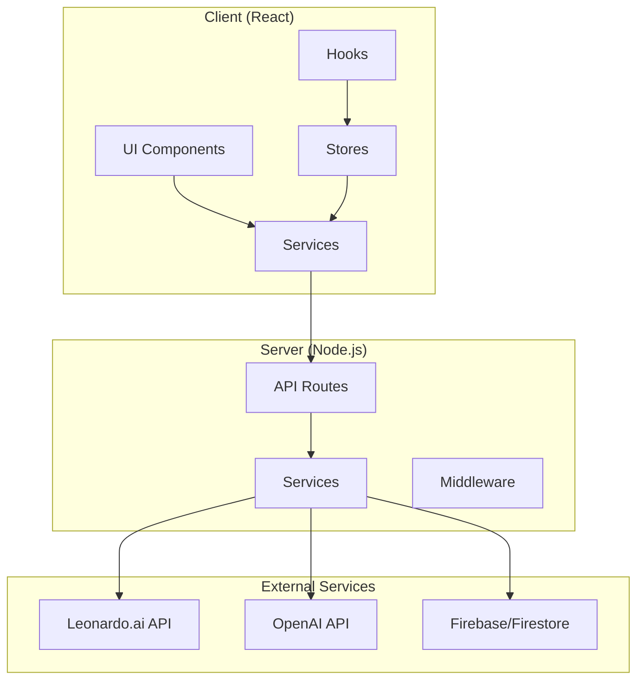
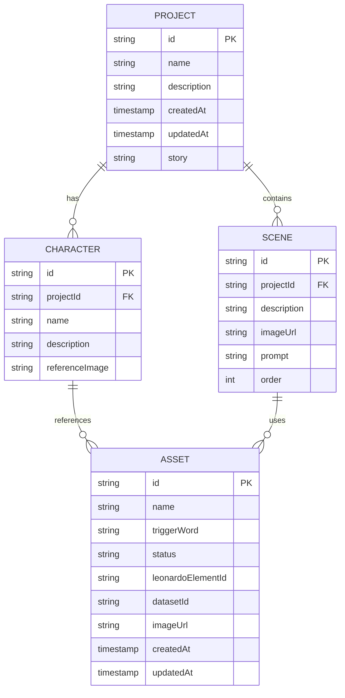

# AI 쇼츠 자동화 프로그램 설계 문서

## 1. 개요

이 문서는 AI 쇼츠 자동화 프로그램의 설계를 정의합니다. 이 웹앱은 사용자가 작성한 스토리를 바탕으로 AI를 활용하여 자동으로 이미지를 생성하고 스토리보드를 만드는 도구입니다.

### 1.1 목적

이 웹앱의 주요 목적은 다음과 같습니다:

- 텍스트 스토리를 시각적 스토리보드로 자동 변환
- AI 기반 이미지 생성을 통한 고품질 비주얼 제작
- 캐릭터 및 에셋 관리를 통한 일관성 있는 스토리텔링
- 사용자 친화적인 인터페이스로 누구나 쉽게 사용 가능

### 1.2 범위

이 웹앱은 다음 기능을 포함합니다:

- 프로젝트 기반 스토리 관리
- 멀티 씬 스토리 작성 및 편집
- 캐릭터 및 커스텀 에셋 관리
- Leonardo.ai를 통한 AI 이미지 생성
- OpenAI를 통한 프롬프트 최적화
- 실시간 스토리보드 미리보기
- 다크/라이트 모드 지원
- 반응형 디자인

## 2. 아키텍처 설계

AI 쇼츠 자동화 프로그램은 모듈화된 아키텍처를 기반으로 설계되며, 프론트엔드와 백엔드가 분리된 구조로 구성됩니다.

### 2.1 전체 아키텍처 개요



### 2.2 클라이언트 아키텍처

```
client/
├── src/
│   ├── components/         # UI 컴포넌트
│   │   ├── App.jsx
│   │   ├── ProjectSelectionPage.jsx
│   │   ├── ProjectDetail.jsx
│   │   ├── StoryManager.jsx
│   │   ├── CharacterManager.jsx
│   │   ├── StoryboardViewer.jsx
│   │   └── ...
│   ├── services/          # API 서비스
│   │   ├── projectApi.js
│   │   ├── assetApi.js
│   │   ├── leonardoApi.js
│   │   └── openaiApi.js
│   ├── stores/            # Zustand 스토어
│   │   ├── projectStore.js
│   │   ├── storyStore.js
│   │   ├── assetStore.js
│   │   └── uiStore.js
│   ├── hooks/             # 커스텀 훅
│   │   └── useDebounce.js
│   └── utils/             # 유틸리티
│       └── toast.js
├── public/
└── package.json
```

### 2.3 서버 아키텍처

```
server/
├── config/               # 설정 파일
│   ├── firebase.js
│   └── logger.js
├── middleware/           # Express 미들웨어
│   └── index.js
├── routes/               # API 라우트
│   ├── projects.js
│   ├── assets.js
│   ├── leonardo.js
│   └── openai.js
├── services/             # 외부 서비스 연동
│   ├── firestoreService.js
│   ├── leonardoService.js
│   └── openaiService.js
├── logs/                 # 로그 파일
├── package.json
└── index.js              # 서버 진입점
```

### 2.4 SOLID 원칙 적용

- **단일 책임 원칙(SRP)**: 각 컴포넌트와 함수는 하나의 책임만 가집니다.
- **개방-폐쇄 원칙(OCP)**: 새로운 기능을 추가할 때 기존 코드를 수정하지 않고 확장할 수 있도록 설계합니다.
- **리스코프 치환 원칙(LSP)**: 상위 타입의 객체를 하위 타입의 객체로 대체해도 프로그램의 정확성이 유지되도록 합니다.
- **인터페이스 분리 원칙(ISP)**: 클라이언트가 사용하지 않는 인터페이스에 의존하지 않도록 합니다.
- **의존성 역전 원칙(DIP)**: 고수준 모듈이 저수준 모듈에 의존하지 않도록 추상화에 의존합니다.

## 3. 주요 컴포넌트 설계

### 3.1 프론트엔드 컴포넌트

#### 3.1.1 App 컴포넌트

메인 애플리케이션 컨테이너로, 라우팅과 전역 상태를 관리합니다.

```jsx
// src/components/App.jsx
import React, { useState, useEffect } from "react";
import ProjectSelectionPage from "./ProjectSelectionPage";
import ProjectDetail from "./ProjectDetail";
import ErrorBoundary from "./ErrorBoundary";

const App = () => {
  const [currentProject, setCurrentProject] = useState(null);
  const [darkMode, setDarkMode] = useState(false);

  return (
    <ErrorBoundary>
      <div className={`app ${darkMode ? "dark" : "light"}`}>
        {currentProject ? (
          <ProjectDetail
            project={currentProject}
            onBack={() => setCurrentProject(null)}
          />
        ) : (
          <ProjectSelectionPage onProjectSelect={setCurrentProject} />
        )}
      </div>
    </ErrorBoundary>
  );
};
```

#### 3.1.2 StoryManager 컴포넌트

스토리 작성, 씬 관리, 이미지 생성을 담당하는 핵심 컴포넌트입니다.

```jsx
// src/components/StoryManager.jsx
import React, { useState, useEffect } from "react";
import * as leonardoApi from "../services/leonardoApi";
import useDebounce from "../hooks/useDebounce";

const StoryManager = ({ trainedAssets = [] }) => {
  const [story, setStory] = useState("");
  const [scenes, setScenes] = useState([]);
  const [generatingScene, setGeneratingScene] = useState(null);

  const debouncedStory = useDebounce(story, 500);

  const generateImage = async (sceneIndex) => {
    // 이미지 생성 로직
  };

  return (
    <div className="story-manager">
      {/* 스토리 입력 UI */}
      {/* 스토리보드 뷰어 UI */}
    </div>
  );
};
```

### 3.2 백엔드 서비스

#### 3.2.1 Leonardo Service

Leonardo.ai API와의 통신을 담당하는 서비스입니다.

```javascript
// server/services/leonardoService.js
class LeonardoService {
  constructor() {
    this.apiKey = process.env.LEONARDO_API_KEY;
    this.baseURL = "https://cloud.leonardo.ai/api/rest/v1";
  }

  async generateImage(payload) {
    // 이미지 생성 로직
  }

  async createDataset(name, description) {
    // 데이터셋 생성 로직
  }

  async trainElement(elementData) {
    // 커스텀 모델 학습 로직
  }
}
```

#### 3.2.2 Firestore Service

Firebase Firestore와의 데이터 통신을 담당하는 서비스입니다.

```javascript
// server/services/firestoreService.js
class FirestoreService {
  constructor() {
    this.db = admin.firestore();
  }

  async createProject(projectData) {
    // 프로젝트 생성 로직
  }

  async getProjects() {
    // 프로젝트 목록 조회 로직
  }

  async updateProject(projectId, updateData) {
    // 프로젝트 업데이트 로직
  }
}
```

### 3.3 상태 관리 (Zustand)

#### 3.3.1 Project Store

프로젝트 관련 상태를 관리합니다.

```javascript
// src/stores/projectStore.js
import { create } from "zustand";
import { immer } from "zustand/middleware/immer";

const useProjectStore = create(
  immer((set, get) => ({
    projects: [],
    currentProject: null,
    loading: false,
    error: null,

    fetchProjects: async () => {
      // 프로젝트 목록 가져오기
    },

    createProject: async (projectData) => {
      // 프로젝트 생성
    },

    selectProject: (project) => {
      set((state) => {
        state.currentProject = project;
      });
    },
  }))
);
```

#### 3.3.2 Story Store

스토리 및 씬 관련 상태를 관리합니다.

```javascript
// src/stores/storyStore.js
import { create } from "zustand";
import { immer } from "zustand/middleware/immer";

const useStoryStore = create(
  immer((set, get) => ({
    story: "",
    scenes: [],
    generatingScene: null,
    loading: {
      generateScene: false,
    },
    error: null,

    setStory: (story) => {
      set((state) => {
        state.story = story;
      });
    },

    generateScene: async (sceneIndex, selectedAsset) => {
      // 씬 이미지 생성 로직
    },
  }))
);
```

## 4. 데이터베이스 설계

### 4.1 Firestore 컬렉션 구조

```
projects/
├── {projectId}/
│   ├── id: string
│   ├── name: string
│   ├── description: string
│   ├── createdAt: timestamp
│   ├── updatedAt: timestamp
│   ├── story: string
│   ├── scenes: array
│   │   ├── id: string
│   │   ├── description: string
│   │   ├── imageUrl: string
│   │   └── prompt: string
│   └── characters: array
│       ├── id: string
│       ├── name: string
│       ├── description: string
│       └── referenceImage: string

assets/
├── {assetId}/
│   ├── id: string
│   ├── name: string
│   ├── triggerWord: string
│   ├── status: string (PENDING, TRAINING, COMPLETE, FAILED)
│   ├── leonardoElementId: string
│   ├── datasetId: string
│   ├── imageUrl: string
│   ├── createdAt: timestamp
│   └── updatedAt: timestamp
```

### 4.2 데이터 관계



## 5. API 설계

### 5.1 프로젝트 관련 API

```javascript
// 프로젝트 목록 조회
GET /api/projects
Response: {
  success: boolean,
  projects: Project[],
  count: number
}

// 프로젝트 생성
POST /api/projects
Body: {
  name: string,
  description?: string
}
Response: {
  success: boolean,
  project: Project
}

// 프로젝트 상세 조회
GET /api/projects/:id
Response: {
  success: boolean,
  project: Project
}

// 프로젝트 업데이트
PUT /api/projects/:id
Body: {
  name?: string,
  description?: string,
  story?: string,
  scenes?: Scene[],
  characters?: Character[]
}
```

### 5.2 에셋 관련 API

```javascript
// 에셋 목록 조회
GET /api/assets
Response: {
  success: boolean,
  assets: Asset[],
  count: number
}

// 데이터셋 생성
POST /api/leonardo/create-dataset
Body: {
  name: string,
  description?: string
}

// 이미지 업로드
POST /api/leonardo/upload-training-image
Body: FormData {
  file: File,
  datasetId: string
}

// 커스텀 모델 학습 시작
POST /api/leonardo/train-element
Body: {
  name: string,
  description: string,
  datasetId: string
}

// 이미지 생성
POST /api/leonardo/generate-image
Body: {
  storyText: string,
  characterName?: string,
  triggerWord?: string,
  assetId?: string
}
```

## 6. 사용자 인터페이스 설계

### 6.1 와이어프레임

#### 프로젝트 선택 페이지

```
┌─────────────────────────────────────────┐
│ AI 쇼츠 자동화 프로그램        [테마토글] │
├─────────────────────────────────────────┤
│                                         │
│  ┌─────────┐  ┌─────────┐  ┌─────────┐  │
│  │프로젝트1 │  │프로젝트2 │  │  새로    │  │
│  │         │  │         │  │ 프로젝트  │  │
│  │ [열기]  │  │ [열기]  │  │  [+]    │  │
│  └─────────┘  └─────────┘  └─────────┘  │
│                                         │
└─────────────────────────────────────────┘
```

#### 프로젝트 상세 페이지

```
┌─────────────────────────────────────────────────────────────┐
│ [← 뒤로] 프로젝트명                              [설정] │
├─────────────────────────────────────────────────────────────┤
│ ┌───────────────────────┐ ┌─────────────────────────────────┐ │
│ │    스토리 작성         │ │        스토리보드              │ │
│ │                      │ │                                │ │
│ │ ┌─────────────────┐   │ │ ┌─────────┐ ┌─────────────────┐ │ │
│ │ │텍스트 에디터     │   │ │ │ SCENE 1 │ │                │ │ │
│ │ │                │   │ │ │설명...  │ │   생성된 이미지   │ │ │
│ │ │                │   │ │ │[생성]   │ │                │ │ │
│ │ └─────────────────┘   │ │ └─────────┘ └─────────────────┘ │ │
│ │                      │ │                                │ │
│ │ 감지된 에셋:          │ │ ┌─────────┐ ┌─────────────────┐ │ │
│ │ [캐릭터A] [캐릭터B]    │ │ │ SCENE 2 │ │                │ │ │
│ └───────────────────────┘ │ │설명...  │ │   생성된 이미지   │ │ │
│                          │ │[생성]   │ │                │ │ │
│ ┌───────────────────────┐ │ └─────────┘ └─────────────────┘ │ │
│ │    학습된 에셋         │ └─────────────────────────────────┘ │
│ │                      │                                   │
│ │ ┌─────┐ ┌─────┐       │                                   │
│ │ │에셋1│ │에셋2│       │                                   │
│ │ │완료 │ │학습중│       │                                   │
│ │ └─────┘ └─────┘       │                                   │
│ │                      │                                   │
│ │ [+ 새 에셋 추가]       │                                   │
│ └───────────────────────┘                                   │
└─────────────────────────────────────────────────────────────┘
```

### 6.2 컴포넌트 계층 구조

```
App
├── ErrorBoundary
├── ProjectSelectionPage
│   ├── ProjectCard
│   └── NewProjectModal
└── ProjectDetail
    ├── Header
    ├── StoryManager
    │   ├── StoryInput
    │   └── DetectedAssets
    ├── AssetManager
    │   ├── TrainedAssetList
    │   ├── AssetCard
    │   └── ImageTrainingForm
    └── StoryboardViewer
        └── SceneCard
```

### 6.3 반응형 디자인

```css
/* 기본 (데스크톱) */
.project-detail {
  display: grid;
  grid-template-columns: 1fr 1fr;
  gap: 2rem;
}

/* 태블릿 */
@media (max-width: 1024px) {
  .project-detail {
    grid-template-columns: 1fr;
  }
}

/* 모바일 */
@media (max-width: 768px) {
  .project-detail {
    padding: 1rem;
  }

  .scene-card {
    flex-direction: column;
  }
}
```

## 7. 테스트 전략

### 7.1 단위 테스트

```javascript
// 예시: 스토리 파싱 테스트
import { parseScenes } from "../utils/storyParser";

describe("Story Parser", () => {
  it("should parse scenes correctly", () => {
    const story = "Scene 1\n---\nScene 2\n---\nScene 3";
    const scenes = parseScenes(story);

    expect(scenes).toHaveLength(3);
    expect(scenes[0].description).toBe("Scene 1");
  });
});
```

### 7.2 통합 테스트

```javascript
// 예시: API 통합 테스트
import request from "supertest";
import app from "../server/index.js";

describe("Projects API", () => {
  it("should create a new project", async () => {
    const response = await request(app).post("/api/projects").send({
      name: "Test Project",
      description: "Test Description",
    });

    expect(response.status).toBe(201);
    expect(response.body.success).toBe(true);
  });
});
```

### 7.3 E2E 테스트

```javascript
// 예시: Playwright를 사용한 E2E 테스트
import { test, expect } from "@playwright/test";

test("should create and manage project", async ({ page }) => {
  await page.goto("/");

  // 새 프로젝트 생성
  await page.click('[data-testid="new-project"]');
  await page.fill('[data-testid="project-name"]', "Test Project");
  await page.click('[data-testid="create-project"]');

  // 스토리 작성
  await page.fill(
    '[data-testid="story-input"]',
    "Test story\n---\nSecond scene"
  );

  // 씬이 생성되었는지 확인
  await expect(page.locator('[data-testid="scene-card"]')).toHaveCount(2);
});
```

## 8. 보안 고려사항

### 8.1 API 키 보안

```javascript
// 환경 변수를 통한 API 키 관리
const LEONARDO_API_KEY = process.env.LEONARDO_API_KEY;
const OPENAI_API_KEY = process.env.OPENAI_API_KEY;

// 클라이언트에서는 API 키를 직접 사용하지 않음
```

### 8.2 입력 검증

```javascript
// 서버 사이드 입력 검증
const validateProjectData = (data) => {
  if (!data.name || typeof data.name !== "string") {
    throw new Error("프로젝트 이름이 필요합니다.");
  }

  if (data.name.length > 100) {
    throw new Error("프로젝트 이름이 너무 깁니다.");
  }
};
```

### 8.3 CORS 설정

```javascript
// CORS 미들웨어 설정
app.use(
  cors({
    origin:
      process.env.NODE_ENV === "production"
        ? ["https://your-domain.com"]
        : ["http://localhost:5173"],
    credentials: true,
  })
);
```

## 9. 성능 최적화

### 9.1 이미지 최적화

```javascript
// 이미지 지연 로딩
const LazyImage = ({ src, alt, ...props }) => {
  return (
     {
        e.target.src = "/placeholder.png";
      }}
      {...props}
    />
  );
};
```

### 9.2 API 요청 최적화

```javascript
// 요청 캐싱 및 재시도 로직
const apiWithRetry = async (url, options, maxRetries = 3) => {
  for (let i = 0; i < maxRetries; i++) {
    try {
      const response = await fetch(url, options);
      if (response.ok) return response;
    } catch (error) {
      if (i === maxRetries - 1) throw error;
      await new Promise((resolve) => setTimeout(resolve, 1000 * (i + 1)));
    }
  }
};
```

### 9.3 상태 관리 최적화

```javascript
// Zustand의 선택적 구독
const useProjectName = () => {
  return useProjectStore((state) => state.currentProject?.name);
};
```

## 10. 배포 전략

### 10.1 클라이언트 배포 (Vercel)

```json
{
  "version": 2,
  "builds": [
    {
      "src": "package.json",
      "use": "@vercel/static-build",
      "config": {
        "distDir": "dist"
      }
    }
  ],
  "routes": [
    {
      "handle": "filesystem"
    },
    {
      "src": "/.*",
      "dest": "/index.html"
    }
  ]
}
```

### 10.2 서버 배포 (Railway)

```dockerfile
FROM node:18-alpine

WORKDIR /app

COPY package*.json ./
RUN npm ci --only=production

COPY . .

EXPOSE 3000

CMD ["npm", "start"]
```

### 10.3 CI/CD 파이프라인

```yaml
name: Deploy

on:
  push:
    branches: [main]

jobs:
  deploy-client:
    runs-on: ubuntu-latest
    steps:
      - uses: actions/checkout@v3
      - uses: actions/setup-node@v3
        with:
          node-version: "18"
      - run: cd client && npm ci
      - run: cd client && npm run build
      - uses: vercel/action@v2
        with:
          vercel-token: ${{ secrets.VERCEL_TOKEN }}

  deploy-server:
    runs-on: ubuntu-latest
    steps:
      - uses: actions/checkout@v3
      - name: Deploy to Railway
        uses: bervProject/railway-deploy@v1.2.0
        with:
          railway_token: ${{ secrets.RAILWAY_TOKEN }}
          service: ${{ secrets.RAILWAY_SERVICE }}
```

## 11. 모니터링 및 로깅

### 11.1 로깅 시스템

```javascript
// Winston을 사용한 구조화된 로깅
const logger = winston.createLogger({
  level: "info",
  format: winston.format.combine(
    winston.format.timestamp(),
    winston.format.errors({ stack: true }),
    winston.format.json()
  ),
  transports: [
    new winston.transports.File({ filename: "logs/error.log", level: "error" }),
    new winston.transports.File({ filename: "logs/combined.log" }),
  ],
});
```

### 11.2 에러 추적

```javascript
// 글로벌 에러 핸들러
process.on("uncaughtException", (error) => {
  logger.error("Uncaught Exception:", error);
  process.exit(1);
});

process.on("unhandledRejection", (reason, promise) => {
  logger.error("Unhandled Rejection at:", promise, "reason:", reason);
});
```

## 12. 결론

이 설계 문서는 AI 쇼츠 자동화 프로그램의 전체 아키텍처와 구현 방안을 제시합니다. 모듈화된 설계와 최신 기술 스택을 활용하여 확장 가능하고 유지보수가 용이한 애플리케이션을 구축할 수 있습니다. Clean Architecture와 SOLID 원칙을 적용하여 유지보수가 용이하고 확장 가능한 웹앱을 구현할 수 있습니다.

주요 특징:

- React 18 + Vite를 사용한 현대적인 프론트엔드
- Node.js + Express를 사용한 견고한 백엔드
- Zustand를 통한 효율적인 상태 관리
- Firebase Firestore를 통한 실시간 데이터 동기화
- Leonardo.ai와 OpenAI API 통합
- 반응형 디자인과 다크모드 지원

이 설계를 바탕으로 사용자 친화적이면서도 강력한 AI 기반 스토리텔링 도구를 개발할 수 있습니다.
